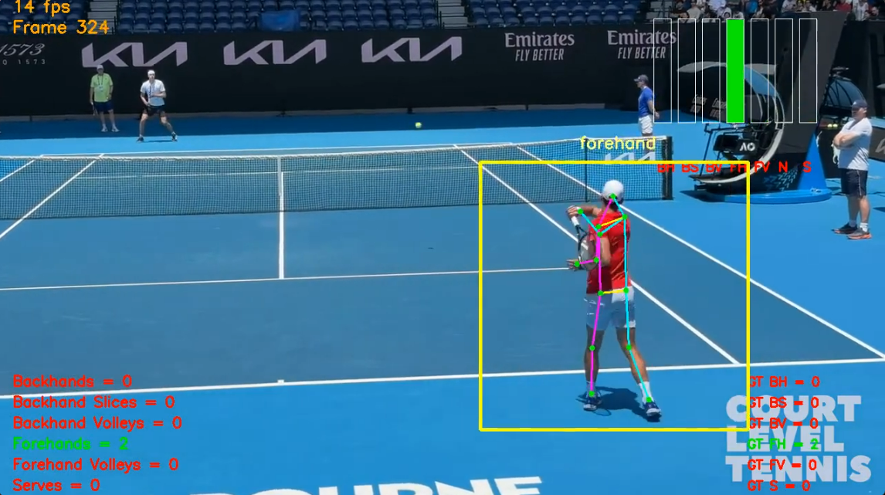

# Tennis Video Analysis

This project provides a complete pipeline for analyzing tennis videos using deep learning and computer vision. It enables automatic detection, classification, and visualization of tennis shots (e.g., forehand, backhand, serve, volley, etc.) from raw video footage. The system leverages pose estimation, feature extraction, and recurrent neural networks (RNNs) to classify shots and visualize player movements.

## Table of Contents

- [Overview](#overview)
- [Features](#features)
- [Project Structure](#project-structure)
- [Installation & Requirements](#installation--requirements)
- [Usage](#usage)
  - [1. Extract Human Pose](#1-extract-human-pose)
  - [2. Annotate and Extract Shot Features](#2-annotate-and-extract-shot-features)
  - [3. Batch Feature Extraction](#3-batch-feature-extraction)
  - [4. Train Shot Classifiers](#4-train-shot-classifiers)
  - [5. Shot Classification on Videos](#5-shot-classification-on-videos)
  - [6. Visualize Features](#6-visualize-features)
- [Models](#models)
- [Notes](#notes)
- [References](#references)

---

## Overview

The pipeline is designed to process tennis match or practice videos and automatically:

1. **Detect and track the player** using pose estimation (MoveNet).
2. **Extract human pose features** for each frame or shot.
3. **Annotate and save features** for training and evaluation.
4. **Train deep learning models** (single-frame and RNN-based) to classify shot types.
5. **Apply trained models** to new videos for shot detection and classification.
6. **Visualize** the extracted features and classification results.

This enables coaches, analysts, and enthusiasts to gain insights into player technique, shot distribution, and match patterns.

---

## Features

- **Pose Estimation**: Uses MoveNet (TensorFlow Lite) to extract 17 keypoints per frame.
- **Region of Interest (RoI) Tracking**: Focuses on the player, dynamically updating the area of interest.
- **Shot Feature Extraction**: Associates pose data with annotated shot types.
- **Batch Processing**: Automates feature extraction for large datasets.
- **Deep Learning Models**: Supports both single-frame and RNN-based classifiers.
- **Shot Classification**: Detects and classifies shots in real time or from video files.
- **Visualization**: Animates and exports pose sequences for analysis or presentation.

---

## Project Structure

```
.
├── image.png                        # Shot Detection Example (screengrab from output video)
├── 4.tflite                         # MoveNet pose estimation model (TensorFlow Lite)
├── tennis_rnn_rafa_diy.keras        # Example RNN model (Keras)
├── tennis_rnn_rafa_diy_balanced.keras # Another RNN model (Keras)
├── track_and_classify_with_rnn.py   # RNN-based shot classification on video
├── track_and_classify_frame_by_frame.py # Single-frame shot classification
├── extract_shots_as_features.py     # Extracts pose features for annotated shots
├── extract_human_pose.py            # Extracts and tracks human pose from video
├── batch_extract_shots.py           # Batch feature extraction for datasets
├── visualize_features.py            # Visualizes pose features and creates GIFs
├── SingleFrameShotClassifier.ipynb  # Jupyter notebook for single-frame model
├── RNNShotClassifier.ipynb          # Jupyter notebook for RNN model
└── ...
```

---

## Installation & Requirements

**Python 3.7+** is recommended.

Install the required packages:

```bash
pip install tensorflow numpy pandas opencv-python imageio tqdm matplotlib seaborn
```

**Note:** You may need to install additional dependencies for Jupyter notebooks and GPU support.

---

## Usage

### 1. Extract Human Pose

Display and debug pose estimation on a video:

```bash
python extract_human_pose.py <video_file> [--debug]
```

- Shows detected keypoints and RoI on each frame.

---

### 2. Annotate and Extract Shot Features

Extract pose features for each annotated shot in a video:

```bash
python extract_shots_as_features.py <video_file> <annotation_csv> <output_dir> [--show] [--debug]
```

- `<annotation_csv>` should contain shot frame indices and types.
- Outputs CSV files with pose features for each shot.

---

### 3. Batch Feature Extraction

Process an entire directory of videos and annotations:

```bash
python batch_extract_shots.py <videos_dir> <annotations_dir> <output_dir> [--show] [--debug] [--continue-on-error]
```

- Matches videos and annotations by filename.
- Calls `extract_shots_as_features.py` for each pair.

---

### 4. Train Shot Classifiers

Use the provided Jupyter notebooks:

- **SingleFrameShotClassifier.ipynb**: Trains a classifier using pose features from single frames.
- **RNNShotClassifier.ipynb**: Trains a recurrent model (e.g., GRU) on sequences of pose features.

You can customize the training data, model architecture, and evaluation inside the notebooks.

---

### 5. Shot Classification on Videos

#### RNN-based (sequence) classification:

```bash
python track_and_classify_with_rnn.py <video_file> <model_file> [--evaluate <annotation_csv>] [--left-handed] [--threshold <float>] [-f <frame>]
```

- Processes the video with a sliding window of 30 frames (1 second).
- Outputs a video with overlaid shot probabilities and counts.

#### Single-frame classification:

```bash
python track_and_classify_frame_by_frame.py <video_file> <model_file> [--evaluate <annotation_csv>] [-f <frame>]
```

- Classifies each frame independently using a single-frame model.

---

### 6. Visualize Features

Animate and export pose sequences from CSV files:

```bash
python visualize_features.py <csv_file(s)> [--gif <output.gif>]
```

- Shows pose animation for each shot.
- Optionally exports as a GIF.

---

## Models

- **image.png**: Shot Detection Example (screengrab from output video)
- **4.tflite**: MoveNet pose estimation model (TensorFlow Lite).
- **tennis_rnn_rafa_diy.keras**: Example RNN model for shot classification.
- **tennis_rnn_rafa_diy_balanced.keras**: Another RNN model (possibly with balanced classes).

You can train your own models using the provided notebooks and your dataset.

---

## Notes

- The system expects videos to be annotated with shot types and frame indices for training.
- The pose extraction and classification are designed for single-player, court-level tennis videos.
- The code is modular: you can swap models, add new shot types, or adapt to other sports with similar pose-based analysis.

---

## References

- [MoveNet: Ultra fast and accurate pose detection model](https://www.tensorflow.org/lite/models/pose_estimation/overview)
- [OpenCV](https://opencv.org/)
- [TensorFlow](https://www.tensorflow.org/)
- [Keras](https://keras.io/)

---

**Contact:**  
For questions or contributions, please open an issue or submit a pull request. 